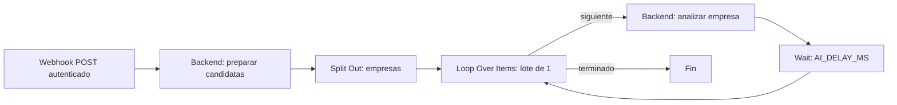
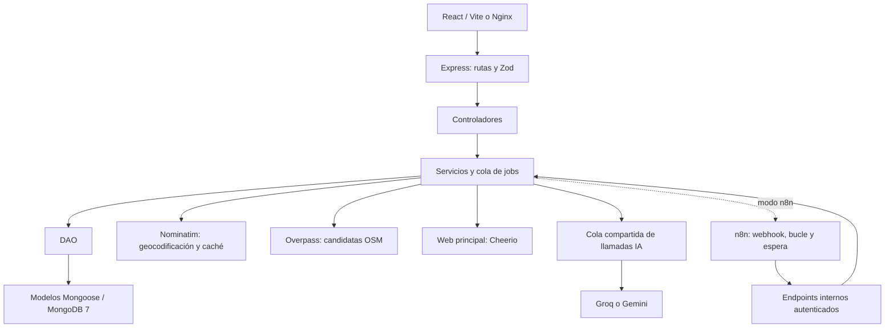

# ProspectorAI

Proyecto docente de DWES para encontrar empresas candidatas a Formación en Empresa FCT/Dual de DAW en Villena. Incluye búsquedas OSM, análisis individual con IA, dashboard, mapa, edición docente, borradores de correo, seguimiento y n8n opcional.

**Fases 0–5 implementadas. Fase 6 implementada, pendiente de comprobar con el motor Docker y publicar el workflow. Fase 7: documentación y scripts incluidos.** Esta sesión no tiene acceso al motor Docker de Windows: la validación de Compose y los tests con mocks no equivalen a un despliegue probado.

La aplicación nunca envía correos. OSM ofrece candidatas, no un censo completo. La IA recibe datos OSM y texto de la página principal; no investiga por su cuenta en Internet ni confirma disponibilidad de prácticas.

La selección se centra en informática y software. Consulta la
[lista de etiquetas y criterios de desarrollo](ETIQUETAS_DESARROLLO.md): se han
eliminado las categorías genéricas de industria, comercios e inmobiliarias.

## Publicar este proyecto en GitHub desde Windows

Para el repositorio `Kilichi/ProspectorAI`, desde PowerShell en esta carpeta:

```powershell
powershell -ExecutionPolicy Bypass -File scripts/publish-github.ps1
```

El script prepara el commit, marca los lanzadores macOS como ejecutables, comprueba
que no se incluyen archivos privados ni las claves locales y hace push sin forzar.
Si Git solicita autenticación, inicia sesión con tu cuenta en su ventana de GitHub.
No escribas tokens ni API keys en el código. `.gitignore` excluye también el PDF
local del enunciado; se publica la aplicación y su documentación.

## Arrancar todo con Docker

### macOS: un comando para arrancar todo

Instala [Docker Desktop para Mac](https://docs.docker.com/desktop/setup/install/mac-install/)
para tu procesador (Apple Silicon o Intel). Clona el repositorio y arranca:

```bash
git clone https://github.com/Kilichi/ProspectorAI.git
cd ProspectorAI
bash startall.sh
```

El script abre Docker Desktop si hace falta, prepara `backend/.env` conservando
claves existentes, genera el token local, construye y arranca los cuatro servicios.
Abre <http://localhost:5173>. También puedes abrir `startall.command` con doble clic.
No necesitas instalar Node.js ni npm en el Mac para arrancar los contenedores.

La primera vez, edita `backend/.env`: configura tu API key, proveedor, modelo y
`HTTP_USER_AGENT`. Repite `bash startall.sh` después de cambiarlo. Sin clave puedes
arrancar y buscar candidatas sin análisis IA. Inicialmente usa
`ORCHESTRATOR=backend`; para configurar y publicar el workflow sigue **Configurar
n8n una vez** más abajo (la reparación requiere Node.js 24 en el anfitrión).
Arrancar n8n no importa ni publica automáticamente el workflow.

GitHub no contiene tus claves, base de datos ni credenciales de n8n: los volúmenes
son locales a cada ordenador. En un Mac nuevo configura n8n una vez.

Para detener todo conservando los datos:

```bash
bash stopall.sh
```

### PowerShell y otros entornos

Necesitas Docker Desktop iniciado con contenedores Linux y Docker Compose. Node.js 24 LTS y npm permiten usar los scripts de ayuda y ejecutar pruebas; las imágenes incorporan sus runtimes.

Desde esta carpeta en PowerShell:

```powershell
npm run docker:prepare
```

El script crea `backend/.env` solo si falta y añade un token aleatorio si está vacío. Conserva las claves existentes y no las imprime. Configura en ese archivo proveedor, modelo, clave gratuita y un `HTTP_USER_AGENT` con contacto real. Mantén `ORCHESTRATOR=backend` durante el primer arranque.

Detén con Ctrl+C cualquier `npm run dev` anterior: utiliza los mismos puertos. Si MongoDB ya pertenece a este Compose, se reutiliza su volumen.

```powershell
npm run docker:check
npm run docker:up
docker compose ps
```

`docker:up` prepara el entorno y ejecuta `docker compose up -d --build`. No necesita instalar dependencias npm en el anfitrión. La primera construcción descarga imágenes y paquetes.

| Servicio | Dirección                          | Función                                    |
| -------- | ---------------------------------- | ------------------------------------------ |
| Frontend | <http://localhost:5173>            | React compilado servido por Nginx          |
| Backend  | <http://localhost:3001/api/health> | Express; health 200 con MongoDB disponible |
| n8n      | <http://localhost:5678>            | Editor y webhooks locales                  |
| MongoDB  | `127.0.0.1:27017`                  | MongoDB 7, base `prospectorai`             |

Todos los puertos están publicados solo en `127.0.0.1`. Nginx dirige `/api` al backend de Docker. Las claves se cargan únicamente en el backend mediante `env_file`; `.dockerignore` impide copiarlas a las imágenes. Frontend y n8n no reciben claves de IA.

```powershell
docker compose logs --tail 80 backend
docker compose logs --tail 80 n8n
npm run docker:down
```

La parada conserva los volúmenes `mongodb_data` y `n8n_data`. No utilices `down -v` si quieres conservar empresas, historial, workflows y credenciales. Tras cambios de código o entorno utiliza de nuevo `npm run docker:up`.

Sin Node/npm en el anfitrión: copia manualmente `.env.example` a `backend/.env` solo si falta, configura sus valores y ejecuta `docker compose up -d --build`. Antes de activar n8n, genera un token aleatorio de al menos 32 caracteres. No reutilices una API key como token.

## Configurar n8n una vez

Si el webhook devuelve 404 o la credencial no está bien asignada, ejecuta desde una terminal con acceso a Docker:

```powershell
npm run n8n:repair
```

Este comando conserva una copia del workflow anterior en `n8n_data` (`/home/node/.n8n/prospectorai-backups`), asigna una credencial gestionada con el token del backend, publica `ProspectorAISearch01`, reinicia n8n y activa `ORCHESTRATOR=n8n`. Después ejecuta una búsqueda real de Villena de 1 km **sin IA** para verificar el recorrido completo hasta MongoDB. No envía correos ni cambia estados de contacto. Las claves IA permanecen en el backend. Si falla la prueba, muestra el id del job y el error; no afirma éxito sin terminarla.

La reparación utiliza el workflow de id `ProspectorAISearch01` importado por CLI y conserva sus otros ajustes y conexiones. Si falta, importa el archivo del proyecto. Si creaste otra copia desde el editor con otro id, esta reparación no la modifica; utiliza después el workflow gestionado y evita publicar dos webhooks con la misma ruta.

El nodo Webhook incluye `webhookId`: sin ese campo n8n antepone el id del workflow y el nombre del nodo a la ruta, aunque esté activado. La reparación añade el campo si falta en una importación anterior. La espera indica el estado HTTP cada diez segundos; no ejecutes varias reparaciones simultáneamente.

Compose configura `N8N_USE_WORKFLOW_PUBLICATION_SERVICE=false` para que los workflows publicados por CLI registren sus webhooks al arrancar. En esta integración, el mecanismo nuevo basado en outbox puede mostrar el workflow como publicado sin registrar la ruta cuando la publicación solo modifica la base mediante CLI. La reparación recrea n8n conservando su volumen para aplicar la variable y comprueba el registro antes de crear la búsqueda de prueba. Véanse la [configuración oficial](https://github.com/n8n-io/n8n/blob/master/packages/%40n8n/config/src/configs/workflows.config.ts) y el [arranque de n8n](https://github.com/n8n-io/n8n/blob/master/packages/cli/src/commands/start.ts). Revisa esta compatibilidad si actualizas n8n.

Se utiliza n8n autoalojado con SQLite en su volumen. No se necesita n8n Cloud, tarjeta ni funciones comerciales: [instalación oficial](https://docs.n8n.io/hosting/installation/docker/) y [Community Edition](https://docs.n8n.io/hosting/community-edition-features/). La imagen está fijada a `2.42.5`; consulta las notas oficiales antes de actualizar.

1. Abre <http://localhost:5678> y crea la cuenta propietaria local de tu instancia.
2. Crea una credencial **Header Auth**, llamada `ProspectorAI local`. En **Name** introduce `X-Orchestrator-Token`; en **Value**, el valor de `ORCHESTRATOR_TOKEN` de `backend/.env`. Cópialo desde tu editor, sin publicarlo. n8n cifra la credencial con la clave almacenada en su volumen.
3. Importa `n8n/workflows/buscar-empresas.json` desde archivo. También está montado como `/workflows/buscar-empresas.json` dentro del contenedor.
4. Selecciona la credencial en los tres nodos: **Buscar empresas**, **Preparar candidatas** y **Analizar empresa**. La referencia del JSON es un marcador, no una credencial real.
5. Guarda y publica/activa el workflow. Utiliza su URL de producción `/webhook/buscar-empresas`; `/webhook-test/` solo responde durante una prueba del editor.
6. Cambia `ORCHESTRATOR=n8n` en `backend/.env` y ejecuta `npm run docker:up` para recrear el backend con ese entorno.
7. Inicia una búsqueda desde la aplicación y observa la ejecución en n8n y el progreso en el navegador.



La preparación limita el lote, omite empresas completadas y termina los lotes vacíos. Los errores individuales de IA se registran y el bucle continúa. El último análisis completa el job. La cola compartida backend sigue imponiendo pausas a cada llamada IA; n8n añade una espera visible entre empresas.

El webhook recibe `{ "searchId": "..." }` desde el backend. También admite parámetros directamente, por ejemplo `{ "localidad": "Villena, Alicante", "radioKm": 30, "perfil": "daw", "analizar": true }`, con la misma cabecera de autenticación. Responde inmediatamente 202; para una entrada directa, consulta el `searchId` en la salida de **Preparar candidatas** y luego `GET /api/searches/:id`.

Si n8n no responde o el workflow no está publicado, el job muestra error. Si una ejecución se detiene a mitad, puede quedar activa hasta el límite de 30 minutos. Revisa la ejecución y repite la búsqueda después: los análisis completados se conservan. No repitas el nodo de preparación ya completado; se rechaza para evitar una segunda consulta Overpass del mismo job.

| Modo                   | Ventajas                                              | Limitaciones                                          |
| ---------------------- | ----------------------------------------------------- | ----------------------------------------------------- |
| `ORCHESTRATOR=backend` | Arranque inmediato, menos componentes, cola Node      | Flujo menos visible fuera de la app                   |
| `ORCHESTRATOR=n8n`     | Bucle y esperas visibles para explicar automatización | Importar, asignar credencial, publicar y mantener n8n |

Reanálisis y borradores utilizan la cola backend en ambos modos. El webhook adicional de correo es opcional y no se incluye: la app ya dispone de editor y endpoint de borradores. Para funcionar sin n8n, configura `backend` y ejecuta `docker compose up -d --build frontend`, que inicia sus dependencias backend/MongoDB.

## Desarrollo con npm

```powershell
npm install
npm run docker:prepare
docker compose up -d mongodb
npm run dev
```

Configura `ORCHESTRATOR=backend`, `HOST=127.0.0.1`, `PORT=3001` y `MONGODB_URI=mongodb://127.0.0.1:27017/prospectorai`. No arranques contenedores backend/frontend a la vez que sus procesos npm. Vite usa 5173 y un proxy al backend 3001. Reinicia el backend tras cambiar el entorno.

Para combinar n8n Docker con backend npm en Windows, cambia las URLs de los dos nodos HTTP a `http://host.docker.internal:3001/...`, utiliza `HOST=0.0.0.0` para que Node sea accesible desde el contenedor y restringe el acceso con el firewall local. El backend utilizará `N8N_WEBHOOK_URL=http://127.0.0.1:5678/webhook/buscar-empresas`. El modo completamente Docker ya trae las URLs correctas y es el recomendado para n8n.

## Obtener claves gratuitas

**Groq:** crea una cuenta en [Groq Console](https://console.groq.com/) y genera una API key en API Keys. Mantén el plan gratuito sin introducir tarjeta ni activar Developer. Consulta [modelos](https://console.groq.com/docs/models) y [límites](https://console.groq.com/docs/rate-limits). Ejemplo configurable:

```dotenv
AI_PROVIDER=groq
AI_MODEL=openai/gpt-oss-20b
GROQ_API_KEY=TU_CLAVE
```

El identificador es un ejemplo; no garantiza disponibilidad permanente.

**Gemini:** entra en [Google AI Studio](https://aistudio.google.com/apikey), crea una clave en un proyecto con cuota gratuita y déjalo sin facturación. Consulta [modelos](https://ai.google.dev/gemini-api/docs/models), [límites](https://ai.google.dev/gemini-api/docs/rate-limits) y [niveles de facturación](https://ai.google.dev/gemini-api/docs/billing). Configura `AI_PROVIDER=gemini`, `GEMINI_API_KEY` y el modelo elegido en `AI_MODEL`. No actives Cloud Billing. Si tu cuenta/región/modelo no tiene cuota gratuita, utiliza el otro proveedor.

Las claves solo existen en `backend/.env`. Sin clave/modelo funcionan health, consultas y búsqueda con `analizar:false`; las operaciones IA fallan antes de consultar OSM. No hay cambio automático de proveedor ni ampliación de pago.

## Variables de entorno

Todas figuran en `backend/.env.example`. Docker sobrescribe `HOST`, `PORT`, `NODE_ENV`, `MONGODB_URI` y `N8N_WEBHOOK_URL` con valores internos.

| Variable                         | Uso y límites                                               |
| -------------------------------- | ----------------------------------------------------------- |
| `NODE_ENV`                       | `development`, `test` o `production`                        |
| `HOST`, `PORT`                   | `127.0.0.1`, `3001`; Docker usa `0.0.0.0`                   |
| `FRONTEND_ORIGIN`                | Origen CORS exacto, `http://localhost:5173`                 |
| `MONGODB_URI`, `LOG_LEVEL`       | MongoDB y nivel debug/info/warn/error                       |
| `HTTP_USER_AGENT`                | Identificación ASCII de 10–200 caracteres con contacto real |
| `AI_PROVIDER`, `AI_MODEL`        | `groq`/`gemini` y modelo configurable                       |
| `GROQ_API_KEY`, `GEMINI_API_KEY` | Solo se necesita la del proveedor seleccionado              |
| `AI_DELAY_MS`                    | Pausa tras cada llamada; 1000–60000, defecto 3000           |
| `AI_MAX_RETRIES`                 | Reintentos 429; 0–3, defecto 2; backoff 2/4/8 segundos      |
| `MAX_COMPANIES_PER_RUN`          | Empresas por lote; 1–100, defecto 15                        |
| `MAX_PENDING_JOBS`               | Activos y pendientes admitidos; 1–20, defecto 5             |
| `ORCHESTRATOR`                   | `backend` por defecto o `n8n` tras publicar workflow        |
| `ORCHESTRATOR_TOKEN`             | Secreto aleatorio compartido, mínimo 32 caracteres          |
| `N8N_WEBHOOK_URL`                | Producción del workflow; Docker usa hostname `n8n`          |
| `SCHOOL_NAME`, `TEACHER_NAME`    | Datos institucionales opcionales                            |
| `SCHOOL_EMAIL`, `SCHOOL_PHONE`   | Contacto institucional opcional                             |

El formulario de correo prevalece sobre el entorno. Datos ausentes quedan como `[NOMBRE DEL CENTRO]`, `[NOMBRE DEL PROFESOR]`, `[EMAIL DEL CENTRO]` y `[TELÉFONO DEL CENTRO]`; complétalos antes del envío manual.

## Guía de usuario: Villena, 30 km

1. Pulsa **Comenzar Prospección**. Indica `Villena, Alicante`, radio 30 km y perfil DAW; alternativamente `38.635`, `-0.866`.
2. Elige si analizar con IA y pulsa **Buscar Empresas Candidatas**. El job responde inmediatamente; el frontend consulta cada 2,5 segundos.
3. Abre los resultados. Puede haber más candidatas guardadas que analizadas por el límite del lote. Repite la búsqueda para seleccionar pendientes, sin repetir automáticamente las completadas.
4. Filtra por interés, tecnología, contacto, texto, puntuación, teletrabajo y análisis. Ordena por nombre/puntuación o distancia dentro de una búsqueda con centro conocido.
5. Alterna tarjetas y mapa. El mapa muestra la página actual y atribución OSM. Las estadísticas abarcan la búsqueda o todas las guardadas, sin aplicar los filtros del listado.
6. Revisa una ficha: actividad, motivos, confianza y fuentes. Edita tecnologías, nota, interés y puntuación. Los campos editados quedan marcados y se conservan ante nuevos análisis; reanalizar requiere acción explícita.
7. En **Contacto**, completa datos del centro, genera el borrador, espera y pulsa **Cargar borrador**. Revisa asunto/cuerpo/destinatario y guarda tus cambios. Copia o abre tu cliente de correo.
8. Envía manualmente desde tu cliente. Después pulsa **Marcar como Contactada**. Copiar o abrir el cliente nunca cambia el estado automáticamente.

Estados: Pendiente, Contactada, Respondió, Interesada y Descartada. Cada cambio incorpora fecha y nota al historial. Dos pestañas no sobrescriben silenciosamente el borrador: la versión guardada detecta conflictos; vuelve a abrir la ficha para cargar la versión actual.

## Arquitectura y decisiones



```text
ProyectoClase/
├── AGENTS.md, README.md, ESTADO.md
├── package.json, package-lock.json, docker-compose.yml, .dockerignore
├── scripts/                 # Docker y limpieza con rutas verificadas
├── backend/
│   ├── Dockerfile, .env.example, package.json
│   ├── tests/               # Vitest/Supertest con mocks
│   └── src/
│       ├── app.js, server.js, config/
│       ├── routes/, controllers/, middlewares/
│       ├── services/        # OSM, webs, análisis, jobs, correo y n8n
│       ├── ai/              # Proveedores generateJSON y prompts
│       ├── dao/, models/    # Persistencia encapsulada
│       ├── profiles/       # Etiquetas OSM para DAW
│       └── utils/
├── frontend/
│   ├── Dockerfile, nginx.conf, vite.config.js
│   ├── tests/               # Playwright
│   └── src/                 # api/, components/, pages/, hooks/, utils/
└── n8n/workflows/           # JSON importable sin secretos
```

Express/ES Modules facilitan explicar el recorrido de una petición. Mongoose solo se usa en modelos/DAO y conexión; Zod valida entradas, configuración y salida IA. MongoDB guarda empresas, evidencia, ediciones e historial, con `osmId` único e índice `2dsphere`.

Se elige **CSS propio** para evitar otra dependencia y facilitar la defensa de estilos y responsive. React separa estados y vistas; Leaflet evita mapas comerciales. Los proveedores usan `fetch` nativo sin SDKs y modelos configurables. Cheerio extrae texto; `ipaddr.js` ayuda a bloquear destinos privados. Helmet, CORS y rate limit protegen la API local. Vite compila y Nginx sirve las imágenes Docker; n8n es opcional para mantener un modo básico sencillo.

## API REST

| Método/ruta                                                               | Operación                                  |
| ------------------------------------------------------------------------- | ------------------------------------------ |
| `GET /api/health`                                                         | Servidor y MongoDB                         |
| `POST /api/searches`                                                      | Búsqueda asíncrona, 202 `{searchId}`       |
| `GET /api/searches/:id`                                                   | Estado/progreso/error                      |
| `GET /api/companies`                                                      | Filtros, orden y paginación                |
| `GET /api/companies/:id`                                                  | Ficha                                      |
| `PATCH /api/companies/:id`                                                | Edición manual marcada                     |
| `POST /api/companies/:id/reanalyze`                                       | Reanálisis explícito, 202 `{searchId}`     |
| `POST /api/companies/:id/email-draft`                                     | Generar borrador, 202 `{searchId}`         |
| `PATCH /api/companies/:id/email-draft`                                    | Guardar asunto/cuerpo y `version`          |
| `PATCH /api/companies/:id/contact-status`                                 | `{estado, nota}` y entrada al historial    |
| `GET /api/stats`                                                          | Totales y tecnologías; `searchId` opcional |
| `POST /api/orchestration/prepare`                                         | Preparar job n8n o parámetros directos     |
| `POST /api/orchestration/searches/:searchId/companies/:empresaId/analyze` | Analizar una empresa del lote n8n          |

Las rutas internas exigen `X-Orchestrator-Token` y rate limit; el frontend no las utiliza. La aplicación docente local no incluye autenticación multiusuario: no publiques sus puertos en Internet.

Búsqueda: `{localidad?, lat?, lon?, radioKm:30, perfil:"daw", analizar:true}`. Localidad o ambas coordenadas, sin mezclarlas. Radio 1–100 km; coordenadas válidas.

Filtros: `interesDAW=true|false|desconocido`, `tecnologia`, `estadoContacto`, `minPuntuacion`, `teletrabajo=true|false|desconocido`, `texto`, `analisisEstado`, `searchId`, `pagina`, `limite`, `orden=nombre|puntuacion|distancia`, `direccion=asc|desc`. Distancia requiere búsqueda con centro. Se escapan las expresiones regulares del texto.

Errores uniformes: `{ "error": { "code": "VALIDATION_ERROR", "message": "..." } }`, sin trazas ni secretos. Ejemplo de búsqueda sin IA:

```powershell
$body = @{ localidad = 'Villena, Alicante'; radioKm = 30; perfil = 'daw'; analizar = $false } | ConvertTo-Json
$job = Invoke-RestMethod -Method Post -Uri http://localhost:3001/api/searches -ContentType 'application/json' -Body $body
Invoke-RestMethod "http://localhost:3001/api/searches/$($job.searchId)"
```

## Límites y seguridad

- Nominatim: máximo una petición/segundo, `User-Agent` identificativo y caché en memoria; se vacía al reiniciar. [Política oficial](https://operations.osmfoundation.org/policies/nominatim/).
- Overpass: una consulta agrupada por búsqueda, nodos/ways con `name`, `around`, `[timeout:60]`, `out center tags`; reintentos limitados 429/504 con backoff. Etiquetas del perfil DAW, normalización de contactos/dirección y distancia Haversine. OSM puede omitir empresas o clasificarlas mal.
- IA: cola secuencial compartida, pausa y reintentos 429. JSON validado con Zod, una corrección si falla; después estado error. Las cuotas gratuitas pueden agotarse aunque se respete la pausa: espera, aumenta pausa o reduce lote. No se amplían de pago automáticamente.
- Web: solo página principal, 8 segundos, 512 KiB y 4000 caracteres visibles; HTTP/HTTPS, DNS/IP validados, bloqueo de redes internas, conexión a la IP validada y redirecciones seguras. Si falla o depende de JavaScript se continúa sin texto y se registra motivo.
- Resultado: actividad, interés, puntuación 0–100, tecnologías con evidencia, teletrabajo, confianza, motivo y fuentes. `null` representa desconocimiento. El prompt reduce invenciones pero requiere revisión docente; no existe verificación automática completa de cada afirmación.
- Jobs: cola en memoria para una instancia backend, sin escalado multiproceso. Los jobs persisten; al reiniciar, los activos pasan a `interrumpida` y las empresas en curso a pendiente. No hay reanudación automática. Las llamadas n8n a jobs interrumpidos se rechazan. Lotes grandes/cuotas bajas pueden superar sus 30 minutos de espera.
- Reintentos: los identificadores atendidos y la cola interna evitan repetir llamadas ya registradas. Una caída entre guardar el análisis y actualizar el contador sigue siendo posible; repetir la búsqueda conserva los análisis completados. No se garantiza exactamente una ejecución distribuida.
- Contacto: borrador versionado para detectar sobrescrituras. `mailto` puede recortarse según cliente; utiliza Copiar. No hay SMTP ni registro completo de correos en logs.
- Mapa: atribución visible, sin precarga masiva ni modo offline; aviso de fallo de tiles. [Política de tiles OSM](https://operations.osmfoundation.org/policies/tiles/). Las fuentes externas tienen alternativa del sistema.
- Privacidad: IA recibe datos públicos y datos institucionales del formulario de correo; no notas internas/historial. No introduzcas datos personales del alumnado y revisa las condiciones del proveedor antes del uso real del centro.

## Pruebas y entrega

```powershell
npm install
npm test
npm run test:ui
npm run lint
npm run format:check
npm run build
npm run docker:check
npm run clean -- --dry-run
```

Vitest/Supertest prueban normalización, Haversine, DAO, JSON inválido, proveedores, SSRF, cola, recuperación, filtros, edición, borradores, estados y autenticación n8n. Playwright prueba flujo, mapa, filtros/edición, error/vacío, móvil y contacto. Utilizan mocks sin APIs reales ni datos ficticios en MongoDB.

Playwright usa Chrome instalado. Si falta, instala Chrome o `npx playwright install chromium` y adapta `channel` en `playwright.config.js`. `docker:check` valida Compose; no sustituye construir/arrancar imágenes ni una ejecución real del workflow. Consulta `ESTADO.md` para resultados y pendientes.

Para entregar sin dependencias:

```powershell
npm run clean -- --dry-run
npm run clean
```

La limpieza verifica todos los destinos y elimina únicamente `node_modules` de raíz/backend/frontend; rechaza junctions, enlaces o rutas externas. Conserva fuentes, `.env` y volúmenes. **Excluye `backend/.env` del ZIP de entrega**: `.gitignore` no protege un ZIP manual. Incluye `.env.example`, lockfile, Dockerfiles y workflow sin secretos.

## Problemas habituales

- **Docker Access denied / pipe docker_engine:** abre Docker Desktop, comprueba contenedores Linux y utiliza una terminal de tu usuario con acceso al motor. Esta sesión restringida no puede concederse ese acceso.
- **Puerto ocupado:** detén el proceso npm o contenedor que ocupa 3001/5173/5678/27017. No borres volúmenes para liberar puertos.
- **Health degradado:** revisa `docker compose ps` y logs; reinicia backend tras recuperar MongoDB.
- **Modelo no disponible:** consulta el catálogo y cambia `AI_MODEL`; no publiques claves al diagnosticar.
- **429:** espera cuota, reduce lote o aumenta pausa; consulta el error de la ficha.
- **n8n 401:** verifica Name `X-Orchestrator-Token`, Value coincidente y credencial seleccionada en los tres nodos; vuelve a publicar.
- **n8n 404:** publica el workflow y usa URL de producción. Los nodos utilizan hostname `backend` dentro de Compose.
- **Borrador en conflicto:** conserva tu texto aparte y vuelve a abrir la ficha antes de guardar.

No hay seeds ni datos ficticios en producción; las candidatas proceden de OSM.
